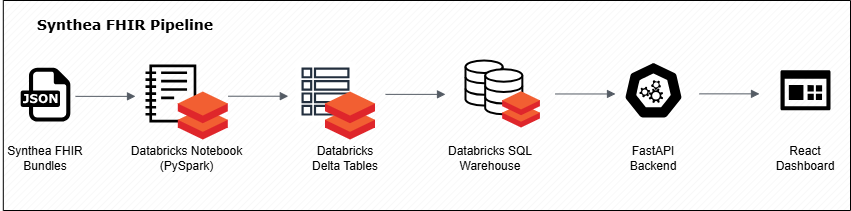
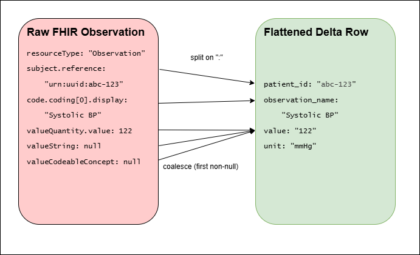
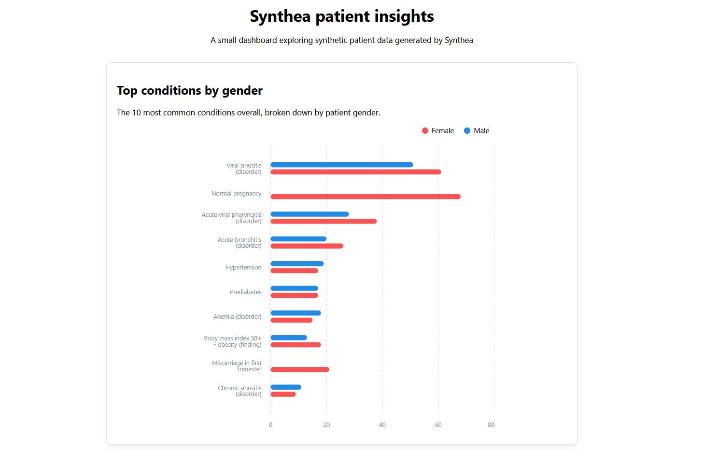

# Pipeline Writeup

## Overview

Synthetic patient data from Synthea (FHIR format) is parsed and flattened in Databricks using PySpark, stored as Delta tables, queried through a Databricks SQL Warehouse, served by a FastAPI layer, and visualized in a React dashboard.

```
FHIR Bundles → Databricks (PySpark) → Delta Tables → SQL Warehouse → FastAPI → React Dashboard
```



## Ingestion & Transformation

- FHIR Bundles uploaded manually to a Unity Catalog volume
- Explored raw Bundle → entry → resource structure before writing any parsing logic
- Defined an **explicit schema** at read time — Spark's default inference collapsed reused field names (e.g., `name`) to the wrong type across resource types, since fields like `Patient.name` and `Organization.name` share a name but differ in shape
- Flattened four resource types: Patient, Encounter, Condition, Observation
- Parsed FHIR `reference` strings (e.g., `"urn:uuid:abc-123"`) into plain join keys via `split(...)`
- Collapsed Observation's multi-shape value fields (`valueQuantity`, `valueString`, `valueCodeableConcept`) into one `value` column using `coalesce`



## Validation

- Null and duplicate checks on key fields before writing to Delta
- Referential integrity check (e.g., every `encounter.patient_id` resolves to a real patient) — returns 0 orphaned rows
- Confirmed with an analytical query: top conditions by gender

## API Layer

- FastAPI service queries the Databricks SQL Warehouse directly via `databricks-sql-connector`
- No data movement required — Delta tables are queried in place, not exported or copied
- Single endpoint reuses the validated `top_conditions_by_gender` SQL query, returned as typed JSON

## Frontend

- React + Vite dashboard, one chart: **top conditions by gender**
- API returns data in "long" format (one row per gender + condition pair) — the chart library needs "wide" format (one row per condition, with `male`/`female` as separate keys)
- Added a client-side pivot step to reshape the API response before charting, then re-sorted and sliced to the top 10 conditions by combined count



## Known Issues & Resolutions

| Issue                                                    | Cause                                                                             | Resolution                               |
| -------------------------------------------------------- | --------------------------------------------------------------------------------- | ---------------------------------------- |
| `INVALID_EXTRACT_BASE_FIELD_TYPE` on nested field access | Schema inference collapsed a reused field name across conflicting resource shapes | Explicit schema defined at read time     |
| `valueQuantity` null on text/coded observations          | Value stored in a different field depending on type                               | `coalesce` across all three value fields |
| Chart not grouping by gender                             | Data was in long format; chart needs wide format                                  | Client-side pivot before rendering       |

## Extensions

- Additional FHIR resource types (Medication, Immunization, Procedure)
- Automated ingestion via EventBridge-style triggers
- Additional dashboard views beyond top conditions by gender
